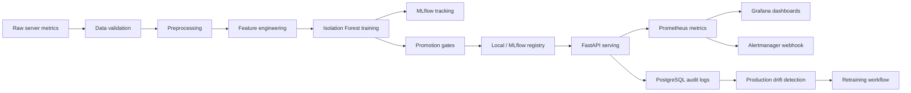

<div align="center">

# final_ddm501

### Production-style MLOps for Server Log Anomaly Detection

[](https://github.com/peaceful-fptu-k16/final_ddm501/actions/workflows/ci.yml)


</div>

`final_ddm501` is an end-to-end MLOps reference stack for detecting anomalies in server logs and infrastructure metrics. It is intentionally runnable on a laptop with Docker Compose, while still demonstrating production concerns: authenticated model serving, JSON request logs, database migrations, prediction audit trails, orchestration, model registry operations, observability, alert routing, drift checks, CI quality gates, image publishing, and security scanning.

## Production Capabilities

| Capability | Implementation |
| --- | --- |
| Authenticated inference | FastAPI protects `/detect` and `/drift` with `X-API-Key` |
| Structured observability | JSON request logs with `request_id`, latency, status, prediction, and model version |
| Database audit trail | PostgreSQL `prediction_logs` table with Alembic migration and CSV fallback |
| Model lifecycle | Local registry promotion gates, rollback CLI, optional MLflow alias sync |
| Experiment tracking | MLflow server backed by PostgreSQL and MinIO artifact storage |
| Orchestration | Airflow DAGs for training, validation, drift, and retraining |
| Monitoring | Prometheus metrics, Grafana dashboard provisioning, Alertmanager routing |
| CI/CD | Ruff, pytest, Compose validation, Trivy scans, GHCR image publish, Compose integration test |
| Load testing | Locust scenario for normal and anomalous prediction traffic |

## Tech Stack

| Layer | Tools |
| --- | --- |
| Serving |   |
| Machine learning |    |
| Orchestration |  |
| Tracking and artifacts |   |
| App dashboard |  |
| Storage |   |
| Observability |    |
| Delivery |    |

## Architecture



## Services

| Service | URL | Purpose |
| --- | --- | --- |
| Airflow | http://localhost:8080 | Pipeline orchestration |
| MLflow | http://localhost:5000 | Experiment tracking and model registry |
| FastAPI | http://localhost:8000/docs | Authenticated model serving |
| Streamlit | http://localhost:8501 | Operations dashboard |
| Prometheus | http://localhost:9090 | Metrics and alert rules |
| Alertmanager | http://localhost:9093 | Alert routing and webhook delivery |
| Grafana | http://localhost:3000 | Monitoring dashboards |
| MinIO | http://localhost:9001 | S3-compatible artifact storage |
| PostgreSQL | localhost:5432 | Metadata and prediction audit trail |

Credentials, API keys, and ports are controlled through `.env`. Start from `.env.example` and replace all `change-me` values before sharing or deploying.

## Quick Start

```powershell
Copy-Item .env.example .env
docker compose up -d --build
docker compose ps
```

Train or refresh the local model:

```powershell
python -m venv .venv
.\.venv\Scripts\Activate.ps1
pip install -r requirements.txt
python -m src.pipeline
```

Run database migrations manually when needed:

```powershell
python scripts/migrate_db.py
```

Send an authenticated prediction:

```powershell
curl -X POST http://localhost:8000/detect `
  -H "Content-Type: application/json" `
  -H "X-API-Key: local-dev-api-key" `
  -d "{\"server_id\":\"srv-01\",\"cpu_usage\":92.5,\"memory_usage\":88.1,\"request_count\":420,\"error_rate\":0.27,\"avg_latency_ms\":1600,\"p95_latency_ms\":2400}"
```

Example response:

```json
{
  "prediction": "anomaly",
  "anomaly_score": -0.61,
  "risk_level": "high",
  "model_version": "v1"
}
```

## Model Registry Operations

Inspect local registry state:

```powershell
python scripts/model_registry.py status
```

Promote or rollback a model version:

```powershell
python scripts/model_registry.py promote v2
python scripts/model_registry.py rollback v1
```

Point an MLflow alias to a registered model version:

```powershell
python scripts/model_registry.py set-mlflow-alias 3 --alias production
```

## Operations Checks

```powershell
docker compose ps
docker compose logs --tail 100 fastapi
docker compose logs --tail 100 airflow-scheduler
```

Smoke-test health and monitoring:

```powershell
Invoke-WebRequest http://localhost:8000/health
Invoke-WebRequest http://localhost:9090/-/ready
Invoke-WebRequest http://localhost:9093/-/ready
Invoke-WebRequest http://localhost:3000/api/health
```

Check prediction audit logs:

```powershell
docker compose exec -T postgres psql -U airflow -d airflow -c "select timestamp, request_id, prediction, model_version from prediction_logs order by timestamp desc limit 5;"
```

## CI/CD

GitHub Actions runs a production-oriented gate:

- Ruff linting
- Pytest suite
- Docker Compose validation
- FastAPI and Streamlit Docker image builds
- Trivy critical vulnerability scans
- GHCR publish on `main`
- Compose integration test for API, migration, PostgreSQL audit logs, Prometheus, Alertmanager, and Grafana

Published image names:

```text
ghcr.io/peaceful-fptu-k16/final-ddm501-fastapi
ghcr.io/peaceful-fptu-k16/final-ddm501-streamlit
```

Dependency upgrades are reviewed manually for this final demo because Airflow, MLflow, NumPy, pandas, and base images have tight compatibility constraints.

## Load Testing

```powershell
pip install -r requirements-loadtest.txt
$env:API_KEY="local-dev-api-key"
locust -f loadtests/locustfile.py --host http://localhost:8000
```

Open http://localhost:8089 and start with 10-25 local users for a smoke test.

## Repository Layout

```text
api/                    FastAPI serving, security, schemas
dashboard/              Streamlit operations dashboard
dags/                   Airflow DAGs
data/raw/               Sample input data
docker/postgres/        PostgreSQL initialization
docs/                   Architecture, demo notes, and runbook
loadtests/              Locust scenarios
migrations/             Alembic database migrations
monitoring/             Prometheus, Alertmanager, and Grafana config
scripts/                Demo, migration, drift, and registry helpers
src/                    Data, feature, model, monitoring, storage, utilities
tests/                  Pytest suite
```

## Documentation

- [Architecture notes](docs/architecture.md)
- [Vietnamese demo guide](docs/ops_demo_vi.md)
- [Operations runbook](docs/runbook.md)

## Production Notes

- Replace default local credentials and `API_KEY` in `.env`.
- Store secrets in GitHub Secrets, Docker secrets, Vault, or a cloud secret manager.
- Keep MLflow host/CORS settings strict outside localhost.
- Use managed PostgreSQL and S3-compatible storage for persistent environments.
- Put FastAPI behind an authenticated gateway or internal ingress.
- Replace the sample Alertmanager webhook with a real Slack, Discord, PagerDuty, or incident bridge.
- Persist model artifacts and registry metadata outside application containers.
