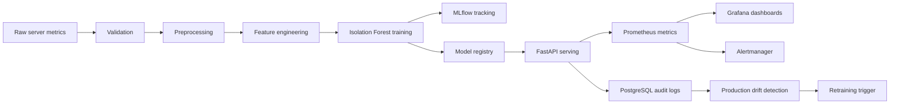

# final_ddm501

[](https://github.com/peaceful-fptu-k16/final_ddm501/actions/workflows/ci.yml)


Production-style MLOps reference project for server log and infrastructure metric anomaly detection. The system is intentionally laptop-friendly, but it includes real operating concerns: orchestration, model tracking, model promotion, API serving, database audit trails, monitoring, alert routing, drift detection, retraining hooks, CI, and runbook documentation.

## Tech Stack

| Layer | Technology |
| --- | --- |
| API serving |   |
| ML pipeline |    |
| Orchestration |  |
| Experiment tracking |   |
| App dashboard |  |
| Data and audit trail |  |
| Observability |    |
| Packaging and CI |   |

## Highlights

- Airflow DAGs orchestrate extraction, validation, feature engineering, training, model promotion, drift checks, and retraining.
- Isolation Forest model is trained with reproducible feature columns and promotion gates.
- MLflow tracks experiments and writes artifacts to a MinIO S3-compatible bucket.
- FastAPI serves predictions and exposes `/health`, `/detect`, `/drift`, and `/metrics`.
- PostgreSQL stores production prediction audit logs, with CSV fallback for local demos.
- Prometheus scrapes API metrics, Alertmanager routes alerts, and Grafana provisions dashboards automatically.
- Streamlit provides an operations dashboard for manual predictions and recent production logs.
- GitHub Actions runs lint, tests, compose validation, and Docker smoke builds.

## Architecture



## Services

| Service | URL | Purpose |
| --- | --- | --- |
| Airflow | http://localhost:8080 | Pipeline orchestration |
| MLflow | http://localhost:5000 | Experiment tracking and model registry |
| FastAPI | http://localhost:8000/docs | Model serving |
| Streamlit | http://localhost:8501 | Operations dashboard |
| Prometheus | http://localhost:9090 | Metrics and alert rules |
| Alertmanager | http://localhost:9093 | Alert routing |
| Grafana | http://localhost:3000 | Monitoring dashboards |
| MinIO | http://localhost:9001 | S3-compatible artifact storage |
| PostgreSQL | localhost:5432 | Metadata and prediction audit trail |

Credentials and ports are controlled through `.env`. Start from `.env.example` and replace every `change-me` value before sharing or deploying.

## Quick Start

```powershell
Copy-Item .env.example .env
docker compose up -d --build
docker compose ps
```

Train or refresh a local model:

```powershell
python -m venv .venv
.\.venv\Scripts\Activate.ps1
pip install -r requirements.txt
python -m src.pipeline
```

Send a prediction:

```powershell
curl -X POST http://localhost:8000/detect `
  -H "Content-Type: application/json" `
  -d "{\"server_id\":\"srv-01\",\"cpu_usage\":92.5,\"memory_usage\":88.1,\"request_count\":420,\"error_rate\":0.27,\"avg_latency_ms\":1600,\"p95_latency_ms\":2400}"
```

Expected response:

```json
{
  "prediction": "anomaly",
  "anomaly_score": -0.61,
  "risk_level": "high",
  "model_version": "v1"
}
```

## Model Lifecycle

1. Validate raw server metrics for schema, numeric ranges, timestamps, duplicate events, and latency consistency.
2. Build rolling features and pressure indicators from server metrics.
3. Train an Isolation Forest model and log metrics/artifacts to MLflow.
4. Promote the model only if it passes registry gates.
5. Serve the promoted model through FastAPI.
6. Store every production prediction as an audit record.
7. Detect production drift and trigger retraining when drift exceeds the threshold.

## Operations

Useful checks:

```powershell
docker compose ps
docker compose logs --tail 100 fastapi
docker compose logs --tail 100 airflow-scheduler
```

Smoke-test observability:

```powershell
Invoke-WebRequest http://localhost:8000/health
Invoke-WebRequest http://localhost:9090/-/ready
Invoke-WebRequest http://localhost:9093/-/ready
```

Check database audit logs:

```powershell
docker compose exec -T postgres psql -U airflow -d airflow -c "select count(*) from prediction_logs;"
```

## CI/CD

The CI workflow validates the project with:

- Ruff linting
- Pytest suite
- Docker Compose config validation
- FastAPI and Streamlit image smoke builds

Dependency upgrades should be reviewed deliberately for this stack because Airflow, MLflow, NumPy, pandas, and Docker base images have tight compatibility constraints. The CI workflow is intentionally kept stable for demo and review.

## Load Testing

```powershell
pip install -r requirements-loadtest.txt
locust -f loadtests/locustfile.py --host http://localhost:8000
```

Open http://localhost:8089 and start with 10-25 local users for a smoke test.

## Repository Layout

```text
api/                    FastAPI serving layer
dashboard/              Streamlit operations dashboard
dags/                   Airflow DAGs
data/raw/               Sample input data
docker/postgres/        PostgreSQL initialization
docs/                   Architecture, demo notes, and runbook
loadtests/              Locust scenarios
monitoring/             Prometheus, Alertmanager, and Grafana config
scripts/                Demo and drift helpers
src/                    Data, feature, model, monitoring, and storage code
tests/                  Pytest suite
```

## Documentation

- [Architecture notes](docs/architecture.md)
- [Vietnamese demo guide](docs/ops_demo_vi.md)
- [Operations runbook](docs/runbook.md)

## Production Notes

- Replace default local credentials in `.env`.
- Keep MLflow host/CORS settings strict outside localhost.
- Use managed PostgreSQL and S3-compatible storage for persistent environments.
- Put FastAPI behind an authenticated gateway or internal ingress.
- Add a real Alertmanager receiver such as Slack, PagerDuty, or an incident webhook.
- Persist model artifacts and registry metadata outside application containers.
