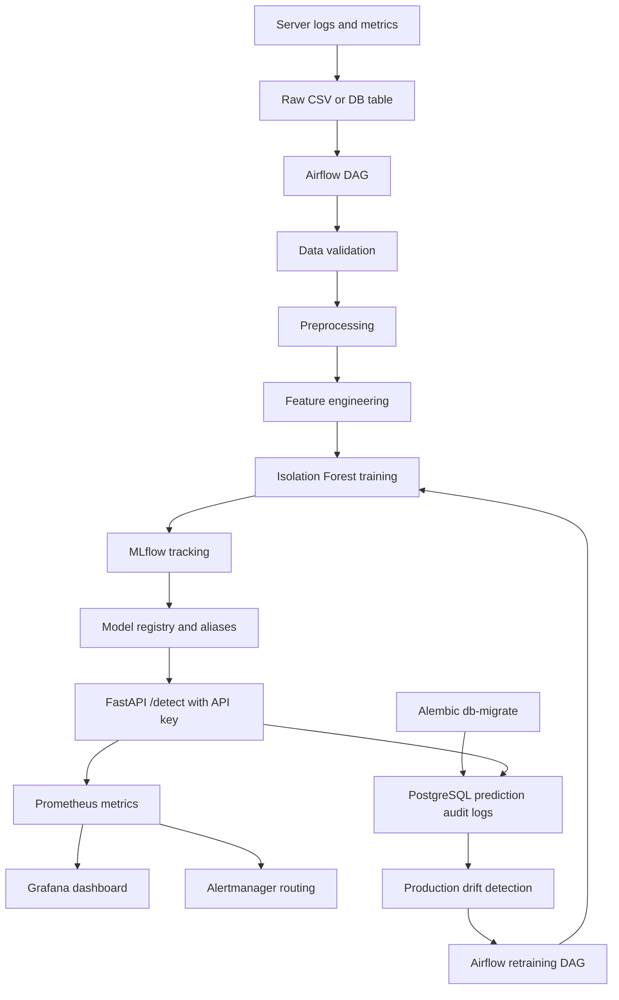

# Architecture

## Runtime services

| Service | Purpose |
| --- | --- |
| Airflow | Schedule training, drift checks, and retraining |
| MLflow | Track experiment params, metrics, artifacts, and versions |
| FastAPI | Serve `POST /detect`, expose `/metrics`, and trigger `/drift` |
| Streamlit | Demo dashboard for prediction and Ops visibility |
| Prometheus | Scrape API metrics and evaluate alert rules |
| Alertmanager | Route warning and critical alerts to a webhook receiver |
| Grafana | Visualize request rate, latency, anomaly rate, and drift |
| PostgreSQL | Metadata backend for Airflow and MLflow, plus prediction audit trail |
| MinIO | S3-compatible artifact store for MLflow |
| db-migrate | Apply Alembic migrations before FastAPI starts |

## Key operational metrics

| Metric | Meaning |
| --- | --- |
| `api_request_count_total` | Total API requests |
| `api_error_count_total` | Total API errors |
| `api_latency_seconds_bucket` | Latency histogram for p95 calculation |
| `prediction_count_total{prediction="anomaly"}` | Anomaly predictions |
| `prediction_anomaly_rate` | Rolling anomaly rate approximation |
| `drift_score` | Latest production drift score |
| `request_id` in audit table | Cross-reference API logs with prediction records |

## Promotion gates

A candidate model is registered only when:

- F1-score is better than the current Production model
- Recall is at least `0.75`
- False positive rate is at most `0.10`

This keeps repeat pipeline runs from creating duplicate model versions when metrics are unchanged.
